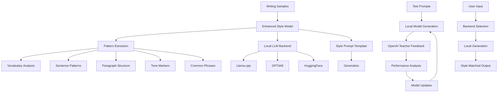

# Local Model Learning and Reinforcement Loop

## Overview

InkMod's enhanced local model learning system combines lightweight LLMs with sophisticated pattern extraction to create a powerful, cost-effective writing style mirroring solution.

## Architecture



## Multi-Backend LLM System

### Supported Backends

InkMod now supports multiple local LLM backends for generation:

#### 1. Llama.cpp Backends
- **llama-7b**: 7B parameter Llama model (GGML format)
- **llama-13b**: 13B parameter Llama model (GGML format)

**Installation:**
```bash
pip install llama-cpp-python
```

**Usage:**
```bash
inkmod train-enhanced --backend llama-7b --style-folder samples/ --test-prompts prompts.txt
```

#### 2. GPT4All Backends
- **gpt4all-j**: GPT4All J model
- **mpt-7b**: MPT-7B Instruct model

**Installation:**
```bash
pip install gpt4all
```

**Usage:**
```bash
inkmod train-enhanced --backend gpt4all-j --style-folder samples/ --test-prompts prompts.txt
```

#### 3. HuggingFace Backends
- **hf-distilgpt2**: DistilGPT2 model
- **hf-tiny-llama**: TinyLlama 1.1B Chat model

**Installation:**
```bash
pip install transformers torch
```

**Usage:**
```bash
inkmod train-enhanced --backend hf-distilgpt2 --style-folder samples/ --test-prompts prompts.txt
```

### Backend Management

#### List Available Backends
```bash
inkmod backends --list
```

#### Get Backend Information
```bash
inkmod backends --info llama-7b
```

#### Test a Backend
```bash
inkmod backends --test gpt4all-j
```

### Backend Configuration

Each backend can be configured with specific parameters:

```python
# Llama.cpp configuration
llama_config = {
    'context_length': 2048,
    'threads': 4,
    'gpu_layers': 0
}

# GPT4All configuration
gpt4all_config = {
    'allow_download': True,
    'top_k': 40,
    'top_p': 0.9
}

# HuggingFace configuration
hf_config = {
    'use_half_precision': True,
    'device_map': 'auto'
}
```

## Enhanced Learning Workflow

### 1. Pattern Extraction
The enhanced model extracts sophisticated patterns from writing samples:

- **Vocabulary Analysis**: Word frequency and diversity metrics
- **Sentence Patterns**: Length, structure, and tone indicators
- **Paragraph Structure**: Multi-sentence patterns and transitions
- **Tone Markers**: Formal, casual, professional, and emphatic indicators
- **Common Phrases**: 2-4 word combinations frequently used

### 2. Style Prompt Template
Creates a comprehensive prompt template that captures the writing style:

```
You are writing in the style of [author]. 
Key characteristics:
- Average sentence length: [X] words
- Tone: [formal/casual/professional]
- Common phrases: [list]
- Structure patterns: [description]

Write a response to: {prompt}
```

### 3. Local Generation
Uses the selected backend to generate style-matched responses:

```python
# Backend selection
model = EnhancedStyleModel(backend_name="llama-7b")
model.set_backend("llama-7b")

# Generation
response = model.generate_response(prompt, max_length=200)
```

### 4. Reinforcement Learning Loop

#### Phase 1: Initial Training
```python
# Train enhanced model with samples
stats = model.train(samples)
print(f"Vocabulary: {stats['vocabulary_size']} items")
print(f"Common phrases: {stats['common_phrases']}")
print(f"Tone markers: {stats['tone_markers']}")
```

#### Phase 2: Iterative Improvement
```python
for iteration in range(iterations):
    # Generate with local model
    local_responses = model.generate_responses(test_prompts)
    
    # Get OpenAI teacher feedback
    feedback = get_teacher_feedback(local_responses, samples)
    
    # Update model based on feedback
    model.update_from_feedback(feedback)
    
    # Analyze performance
    performance = analyze_performance(local_responses, feedback)
```

#### Phase 3: Performance Analysis
- **Style Similarity**: How well responses match the target style
- **Tone Consistency**: Appropriate tone usage
- **Structure Quality**: Sentence and paragraph structure
- **Cost Comparison**: Local vs OpenAI costs

## Benefits of Multi-Backend System

### 1. Flexibility
- Choose the best backend for your use case
- Switch between backends without retraining
- Support for different model sizes and capabilities

### 2. Cost Efficiency
- Local generation reduces API costs
- Different backends have different resource requirements
- Choose based on available hardware

### 3. Performance Optimization
- Llama.cpp: Fast inference, good for real-time use
- GPT4All: Balanced performance and resource usage
- HuggingFace: Maximum flexibility and model variety

### 4. Privacy
- All generation happens locally
- No data sent to external APIs
- Complete control over model and data

## Usage Examples

### Basic Training with Backend
```bash
# Train with Llama.cpp backend
inkmod train-enhanced \
  --style-folder writing-samples/ \
  --test-prompts test-prompts.txt \
  --backend llama-7b \
  --iterations 5
```

### Backend Comparison
```bash
# Test different backends
inkmod backends --test llama-7b
inkmod backends --test gpt4all-j
inkmod backends --test hf-distilgpt2
```

### Advanced Configuration
```python
# Custom backend configuration
from core.llm_backends import LlamaCppBackend

custom_config = {
    'context_length': 4096,
    'threads': 8,
    'gpu_layers': 1
}

backend = LlamaCppBackend('models/custom-model.ggml', custom_config)
```

## Performance Metrics

### Training Metrics
- **Vocabulary Size**: Number of unique words learned
- **Pattern Count**: Extracted sentence and paragraph patterns
- **Tone Diversity**: Variety of tone markers identified
- **Style Score**: Overall style similarity (0-1)

### Cost Analysis
- **Local Generation Cost**: Minimal (hardware only)
- **OpenAI Teacher Cost**: ~$0.002 per feedback cycle
- **Total Training Cost**: Significantly reduced vs pure OpenAI

### Quality Metrics
- **Style Consistency**: How well responses match target style
- **Tone Appropriateness**: Correct tone usage
- **Structural Quality**: Sentence and paragraph structure
- **Readability**: Natural flow and coherence

## Future Enhancements

### Planned Features
1. **Model Fine-tuning**: Direct fine-tuning of local models
2. **Ensemble Methods**: Combine multiple backends
3. **Adaptive Selection**: Automatically choose best backend
4. **Custom Models**: Support for user-provided models

### Integration Possibilities
- **LangChain Integration**: Connect with LangChain ecosystem
- **Vector Databases**: Enhanced pattern storage
- **Real-time Learning**: Continuous model updates
- **Multi-modal Support**: Images, audio, and text

## Troubleshooting

### Common Issues

#### Backend Not Available
```bash
# Check available backends
inkmod backends --list

# Install missing dependencies
pip install llama-cpp-python  # For Llama.cpp
pip install gpt4all          # For GPT4All
pip install transformers torch  # For HuggingFace
```

#### Model Loading Errors
```bash
# Check model paths
inkmod backends --info llama-7b

# Download models if needed
# Llama.cpp models: Download from HuggingFace
# GPT4All models: Auto-downloaded
# HuggingFace models: Auto-downloaded
```

#### Performance Issues
- Reduce context length for memory constraints
- Use fewer threads for CPU-only systems
- Enable GPU layers if available
- Choose smaller models for faster inference

### Debug Mode
```bash
# Enable debug output
export INKMOD_DEBUG=true
inkmod train-enhanced --backend llama-7b
```

This enhanced system provides a powerful, flexible foundation for local writing style learning with multiple backend options, comprehensive pattern extraction, and iterative improvement through reinforcement learning. 